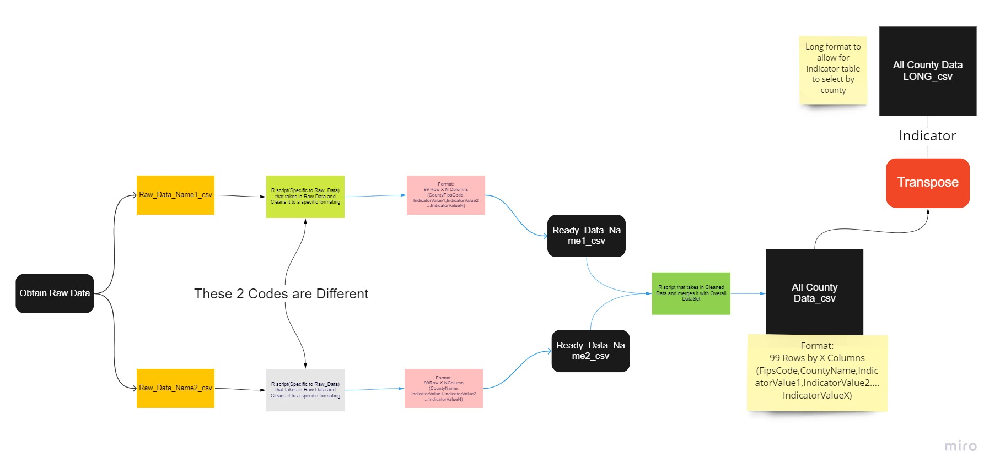

# Data Science for the Public Good
The Data Science for the Public Good (DSPG) Young Scholars program is an immersive summer program that engages students from across Iowa to work together on projects that address local and state government challenges around critical social issues relevant in the world today. DSPG resident scholars conduct research at the intersection of statistics, computation, and the social sciences to determine how information generated within every community can be leveraged to improve quality of life and inform public policy. To learn more about the program click [here](https://dspg.iastate.edu/)
# CED Housing

In this project, we explored how much and what types of data are available to describe local housing markets and fill the gaps of correctly responding to housing demand. We obtained, reorganized, categorized, and analyzed data sets from a wide variety of housing-related sources, and provided a set of housing-related indicators summarized and visualized in a unified format. Additionally, we applied a set of text analysis on data from RHRA surveys to clarify housing needs priorities of a number of communities in Iowa.

# Workflow

[Link](https://miro.com/app/board/uXjVOpF0yPc=/?share_link_id=566569073982) to Miro website of Diagram

[Github Location](Images)

## Process

1.  Obtain Raw Data

2.  Use R script (specific to raw data) to aggregate and clean data to specific formatting

    Format:

        First Column: FIPS code of areas you want to look at 

        Second Column: Indicator values with uniquely identifing column names

3.  Save as a clean csv and store in folder for clean data

4.  Repeat Steps 1-3 for every raw data source you want

5.  Once all clean files are made and stored in same folder run [R script](Code/MergingCode/Merge_ALLCleanDataToAllCounty.R) that will merge data together to one file

    [Code](Code/MergingCode/Merge_OneCleanDataToAllCounty.R) to merge just one file to overall data file

This is the process we went through for this project.

As you add more and more raw data files, you would just have to create a script that would clean and aggregate them, the script in step 5 should then be rerun and it will add that new data to the overall file.

If you want to change level of geography, you would just have to change it in the cleaning and aggregation scripts to accommodate whatever level you want

# Indicators' List

List of Data Sources

-   Census
-   ACS
-   HUD
-   HUD-USPS
-   Iowa Realtors Association
-   Iowa Legal Aid
-   BEA
-   Iowa Department of Education
-   Iowa Department of Management
-   Zillow
-   FHFA

[Sheet](indicator_definitions_updated.xlsx) with list of all indicators

|                                         |             |                  |             |
|------------------|------------------|------------------|------------------|
| Indicators                              | Source      | Lowest Geography | Data Period |
| USDA 515 units rate                     | USDA        | Place            |             |
| LIHTC units rate                        | HUD         | Place            |             |
| Multi-Family rate                       | Source      | Place            |             |
| Average Eviction Filing                 | IALegalAid  | Place            | 2019-21     |
| Eviction Filing trend                   | IALegalAid  | Place            | 2019-21     |
| Multi-Family share                      | ACS         | Place            | 2016-20     |
| Rental ratio                            | ACS         | Place            | 2016-20     |
| 5-year Section 8 rate                   | HUD         | Place            |             |
| 5-year LIHTC rate                       | HUD         | Place            |             |
| 5-year loan USDA 515 rate               | USDA        | Place            |             |
| Long-term vacancy rate                  | HUD-USPS    | Place            |             |
| Recent vacancy rate                     | HUD-USPS    | Place            |             |
| 5-year vacancy rate                     | ACS         | Place            | 2016-20     |
| 2020 Census vacancy rate                | Decennial   | Place            | 2020        |
| Aging housing stock                     | ACS         | Place            | 2016-20     |
| Multi-family construction rate          | Census-BP   | Place            | 2017-21     |
| Single-family construction rate         | Census-BP   | Place            | 2017-21     |
| Average days on market                  | IARealAssoc | County           | 2022        |
| Single-family home inventory ratio      | IARealAssoc | County           | 2022        |
| Owner-occupied rate                     | ACS         | Place            | 2016-20     |
| Affordability index                     | ACS         | Place            | 2016-20     |
| Housing price dispersion                | ACS         | Place            | 2016-20     |
| Housing price trend - FHFA              | FHFA        | County           | 2016-21     |
| Housing price trend - Zillow            | Zillow      | County           | 2017-21     |
| Housing-burdened owner rate             | ACS         | Place            | 2016-20     |
| Housing-burdened renter rate            | ACS         | Place            | 2016-20     |
| Typical Renter Costs                    | ACS         | Place            | 2016-20     |
| Typical Owner Costs                     | ACS         | Place            | 2016-20     |
| Owner-occupied Median Value             | ACS         | Place            | 2016-20     |
| 10-year population trend                | Decennial   | Place            | 2010-20     |
| 10-year PK-12 enrollment trend          | IA_DOE      | School District  | 2012-22     |
| Average employment growth               | BEA         | County           | 2010-19     |
| Recent Employment change rate           | BEA         | County           | 2019-20     |
| Unemployment rate                       | BLS         | County           | 2021        |
| Government-dependent income rate        | BEA         | County           | 2020        |
| Property tax capacity                   | IA_DOM      | Place            |             |
| Property tax effort                     | IA_DOM      | Place            |             |
| Diversity index                         | Decennial   | Place            | 2020        |
| Income inequality index                 | ACS         | Place            | 2016-20     |
| Prime working age population share      | ACS         | Place            | 2016-20     |
| Elderly-to-working age population ratio | ACS         | Place            | 2016-20     |
| Linguistic-burdened rate                | ACS         | Place            | 2016-20     |
| Disability rate                         | ACS         | Place            | 2016-20     |
| Poverty rate                            | ACS         | Place            | 2016-20     |
| 5 year Fair Market Rent Change          | HUD         | Place            | 2016-20     |
| Recent Fair Market Rent Change          | HUD         | Place            | 2020-22     |
| 5 year wage and salaried employment     | BEA         | County           | 2016-20     |
| 5 year total employment change rate     | BEA         | County           | 2016-20     |

# Dashboard

[Tableau Public](https://public.tableau.com/views/HousingIndicatorDashboard_16595395581510/LandingPage?:language=en-US&:display_count=n&:origin=viz_share_link)

Our dashboard allows users to explore housing related indicators.  It is built using Tableau, and has three main pages. Each page does a different kind of analysis. The first allows the user to explore a single county, the second allows one to map an indicator and the third allows to compare two indicators. 

The first page hosts a speedometer graph built with R Shiny. This graph summarizes the selected county and indicator, allowing the user to quickly understand information related to a county. 

The second page displays an indicator in an Iowa county map. It allows the user to see how the selected indicator is distributed statewide. 

The third page displays two indicators in a scatterplot. This analysis tool allows the user to find relationships between indicators and can also see these mapped. 

# Text Analysis
Simple Wordcloud: 
Visual representation of words where each word's size represents its frequency. 
Allows for keyword identification and visualization.

Collocation and Co-Ocurrences Wordcloud: 
Displays multi-word expressions and relationships between them. 
Looks at words following one another and words in the same "neighborhood".

# Links
# Participants

The CED Housing project team brought together backgrounds in Community and Regional Planning, Software Engineering, Data Science, and Statistics, with interests in applications of technical skills to achieve meaningful impacts for decision making processes related to local housing policy.

-   Liesl Eathington - Team Leader, Iowa State University, Research Scientist III
-   Romina Tafazzoli - Graduate Fellow, Iowa State University, Community and Regional Planning and Graduate GIS Certificate
-   Cory Roth - Intern, Iowa State University, Software Engineering and Data Science
-   Félix Báez-Santiago - Intern, Iowa State University, Data Science (emphasis in Statistics)
-   Tanishq Jain - Intern, Iowa State University, Statistics with a minor in Data science
